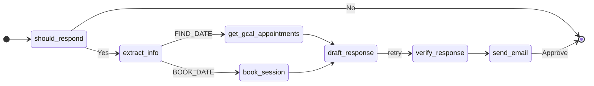

# Inbox AI Agent

This project creates an AI-powered Gmail agent using LangChain to help manage your inbox.

## Agent Flow

Below is the optimal flow for the agent.



```
stateDiagram
    direction lr
    [*] --> should_respond
    should_respond --> draft_response : Yes
    should_respond --> [*] : No
    draft_response --> verify_response
    verify_response --> should_respond : Retry
    verify_response --> sign_email
    sign_email --> send_mail
    send_mail --> [*] : Approve
```

## Additional Work

- [ ] Add a tool to create a draft response
- [ ] Fine train the model to learn from my own email responses
- [ ] Prompts are not optimal and only used for MVP
